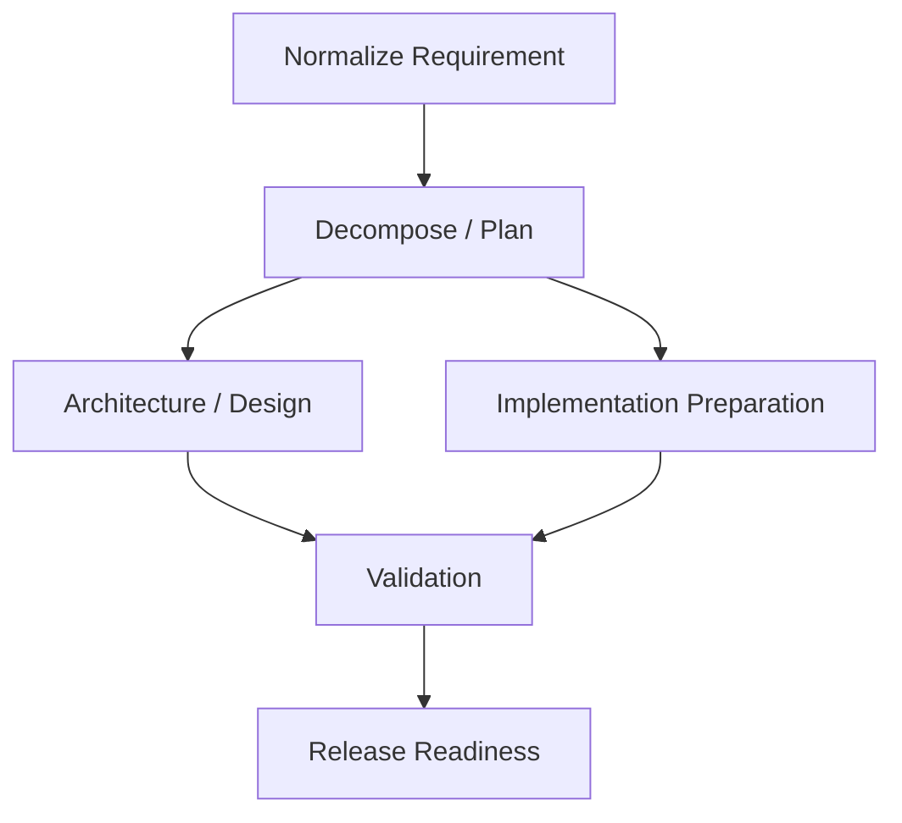

# Architecture and Governance

## Objective

The system is a governance-first agentic software engineering prototype. It turns a requirement into persisted, reviewable engineering evidence. The URL shortener is the bounded workload used to make the workflow concrete and testable.

## Modular Monolith

The application is one ASP.NET Core .NET 10 process with explicit internal boundaries:

- URL Shortener: validated targets, generated short codes, redirects, and privacy-minimized click events.
- Orchestration: workflow creation, DAG readiness, execution waves, replanning, rollback, and status.
- Providers: bounded workers behind `IAgentProvider`; deterministic providers make review and tests credential-free.
- Persistence: one SQLite database with logical table prefixes for URL-shortener and orchestration data.
- Governance: risk policy, approvals, exact ChangeSet authorization, retries, fallback, SafeStop, and escalation.
- Observability/API: persisted `WorkflowEvent`, status projections, artifacts, validations, and derived metrics.

A modular monolith keeps state transitions visible and local for the exercise. Production evolution would separate durable workflow coordination, storage, policy, and execution infrastructure only when scale and availability require it.

## Trust Boundary

Providers have bounded execution capability, not authority. They may produce artifacts and propose a bounded privileged operation. They cannot set authoritative risk, approve work, create authorization evidence, change the active plan, or mark work Applied.

The orchestrator owns workflow and node state, dependency readiness, risk policy, approval requirements, exact ChangeSet binding, retries, fallback, SafeStop, replanning, rollback, and application state.

For governed implementation preparation, the path is:

```text
provider Proposal mode
  -> ActionProposal
  -> immutable bounded ChangeSet
  -> deterministic SHA-256 fingerprint
  -> structural and active-plan validation
  -> Gate 3 policy or human approval
  -> persisted ChangeSetAuthorization
  -> apply boundary reloads exact authorization
  -> provider Apply mode
  -> ActionProposal Applied
```

Authorization is persisted before Apply. The authorization records the workflow, node, active PlanRevision, proposal, ChangeSet, fingerprint, mechanism, and human Approval when applicable. A stale plan, changed fingerprint, different provider lineage, or different ChangeSet cannot reuse the authorization.

There is no arbitrary shell, filesystem, SQL, Git, or deployment executor in this prototype.

## Persisted DAG



The graph is persisted through workflow nodes and dependencies. The independent architecture and implementation branches become ready together after planning. The validation node is a synchronization barrier requiring both predecessors. Ready-wave execution is deterministic and sequential in this prototype; parallel-ready means dependency-aware readiness, not concurrent worker threads.

The orchestrator fails fast within an execution wave when a node fails, preserving a ready sibling for inspection rather than silently executing it after the workflow stops.

## State and Gates

Workflow states include Planning, Executing, WaitingForApproval, Replanning, Recovering, Validating, ReleaseReadiness, Completed, Failed, SafeStopped, and RollingBack. Node states include Pending, Ready, Executing, WaitingForApproval, RetryScheduled, Validating, Succeeded, Failed, Invalidated, and related recovery states.

Entry readiness is dependency-derived. Provider output must pass a structural exit gate before an artifact is accepted. Validation and release-readiness evidence are persisted. High-risk work waits for approval. SafeStopped stops scheduling and preserves evidence. Successful work is rerun only after explicit invalidation and replanning.

## Artifact and Decision Lineage

`EngineeringArtifact` records preserve version, content hash, producer node, producer execution, validation state, and supersession. `ArtifactDependency` records identify upstream evidence used by downstream artifacts. Effective provider context selects current artifact versions while historical versions remain available.

`PlanRevision` records preserve plan supersession. `WorkflowEvent`, `AgentExecution`, `ValidationResult`, `Approval`, `ActionProposal`, `ChangeSet`, and `ChangeSetAuthorization` together allow reconstruction of:

```text
requirement
  -> plan revision
  -> node/provider execution
  -> artifact and dependency lineage
  -> validation
  -> policy/approval/ChangeSet authorization
  -> release decision
```

Historical evidence is not deleted. Current release readiness uses current effective artifacts and current validation lineage rather than stale historical evidence.

## Scenarios

### Greenfield

A clear requirement starts at Normalize Requirement, moves through Decompose / Plan, reaches the two parallel-ready branches, synchronizes at Validation, and finishes at Release Readiness. The resulting workflow status exposes executions, artifacts, validations, events, and metrics.

### Brownfield

The implemented brownfield operation is generic artifact revision rather than alias-specific product behavior. A reviewer can revise an existing artifact through `POST /api/workflows/{workflowId}/brownfield/artifacts/{artifactId}/revise`. The orchestrator creates a new artifact version and PlanRevision, traverses persisted dependencies, invalidates only impacted nodes, preserves unaffected successful work, re-executes affected work, and reevaluates release readiness. `POST /api/workflows/{workflowId}/rollback` restores a prior artifact state through a new immutable version and selective invalidation.

Custom aliases remain deferred.

### Ambiguous Requirement

The bounded deterministic assessor recognizes expiration/unspecified/unclear signals. `Make shortened URLs expire.` enters Blocked with `ClarificationRequired` evidence and does not invoke providers. `POST /api/workflows/{workflowId}/clarification` accepts a non-empty human clarification, reassesses the original requirement plus clarification, persists a hashed clarified-requirement artifact, and resumes only when bounded duration and UTC information are present.

The scenario demonstrates controlled ambiguity handling. It does not implement expiration behavior itself.

## Recovery and Metrics

Transient provider failures create bounded retry evidence. Permanent or policy-blocked failures may select an explicitly compatible fallback, otherwise the workflow SafeStops and records escalation. Privileged Apply is intentionally outside the normal retry loop and an Applied proposal cannot be replayed.

`GET /api/workflows/{workflowId}/metrics` derives completion, workflow latency, provider execution count/latency, retry count/rate, fallback count/rate, SafeStop, approval count/wait, and Mean Recovery Time from persisted evidence. Mean Recovery Time uses structured retry node/attempt evidence and a subsequent successful execution.

## Security and Privacy

The prototype uses exact ChangeSet fingerprints, active-plan checks, human approval for high-risk work, deterministic policy, bounded provider contracts, and no external credentials. It does not claim production authentication, RBAC, secrets management, compliance certification, or deployment security.

Click analytics retain link identity, timestamp, and outcome without persisting source/client IP by default.

## Assumptions and Limitations

- SQLite and startup migrations are local-prototype choices.
- Ready waves are sequentially executed rather than concurrently scheduled.
- Provider reasoning is deterministic; no external LLM is required.
- Rollback is workflow/artifact rollback, not deployment, Git, or database-backup rollback.
- Identity/authentication is not production-grade.
- Metrics are persisted-evidence derivations, not an OpenTelemetry/alerting stack.
- Alias behavior, expiration enforcement, dashboard, Docker, and external LLM integration are deferred.

## Production Evolution

A production system would evolve toward durable distributed orchestration with queue/event transport, a production relational database, distributed locking, idempotency keys, and durable artifact/audit storage. Policy would move to an external catalog or policy service, with enterprise identity/RBAC, secrets management, approval expiry, and compliance controls.

Operations would add OpenTelemetry tracing, metrics/alerting, retention policies, multi-environment release recovery, deployment rollback, database migration rollback procedures, disaster recovery, rate limiting, security hardening, and multi-tenancy. Scheduling would require concurrency controls and backpressure. Provider evolution would add model routing, prompt/model version governance, evaluation, cost/token controls, and carefully isolated external LLM adapters.

These are production evolution paths, not capabilities claimed by this prototype.
