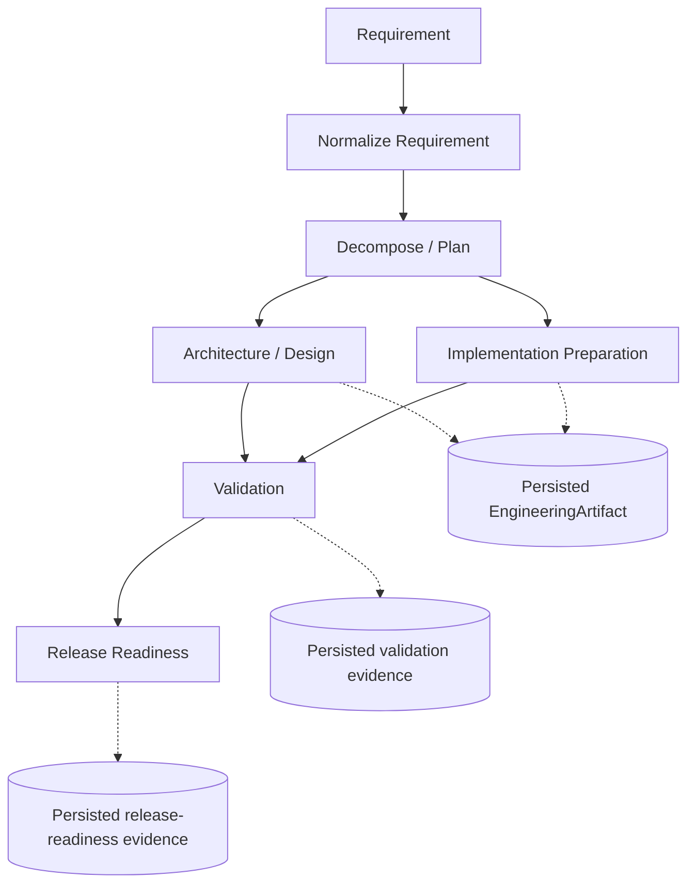
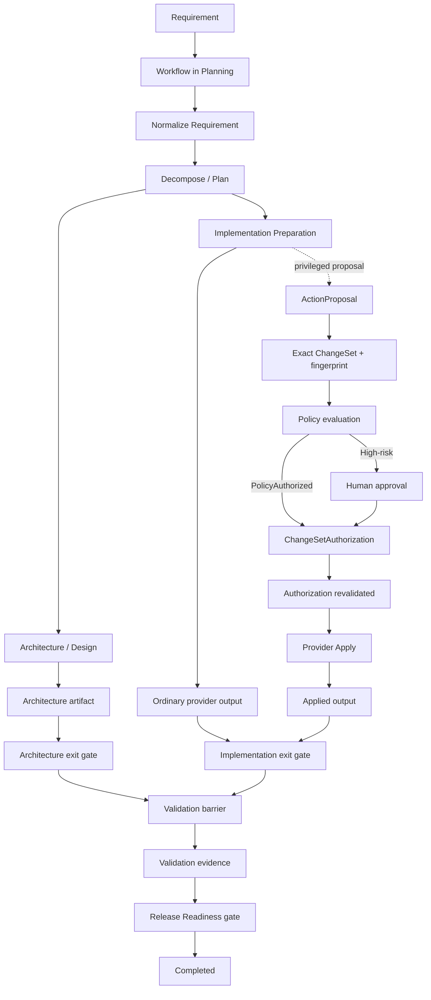
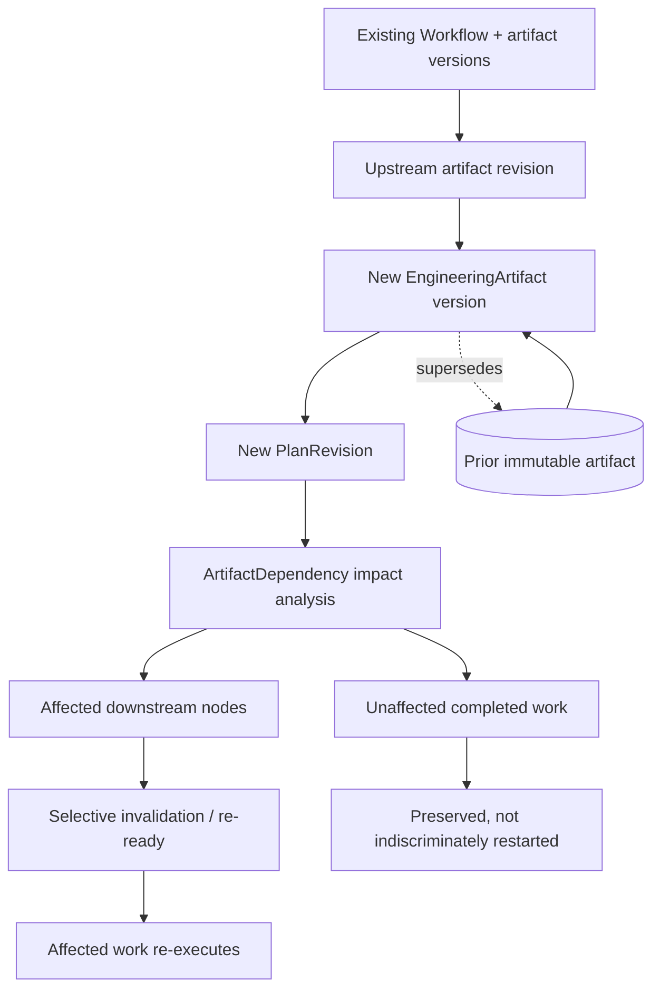
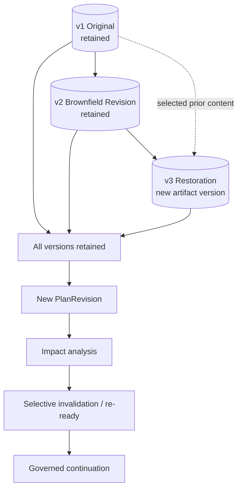
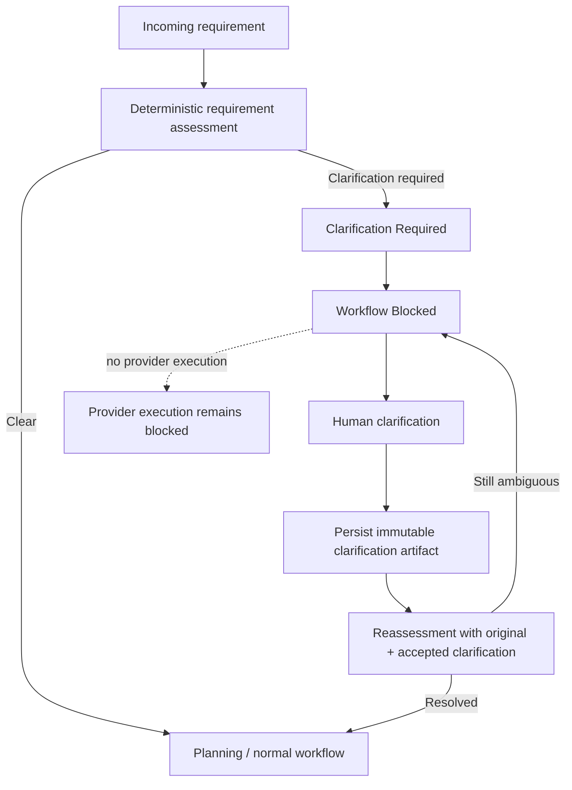

# Architecture and Governance

## Objective

The system is a governance-first agentic software engineering prototype. It turns a requirement into persisted, reviewable engineering evidence. The URL shortener is the bounded workload used to make the workflow concrete and testable.

## Key Terminology

### Directed Acyclic Graph (DAG)

The workflow is represented as directed dependency relationships with no cycles. A node becomes eligible only when its required predecessors satisfy the necessary conditions.

### Workflow Node

A persisted unit of engineering work within the DAG, with lifecycle state, dependencies, execution evidence, and outputs.

### Parallel-ready

Multiple nodes have independently satisfied their dependencies and can become eligible at the same point in the DAG. In this prototype, parallel-ready describes dependency independence, not concurrent worker execution. Deterministic sequential waves execute the ready work.

### Synchronization Barrier

A dependency point where downstream work remains blocked until all required upstream branches satisfy their gates. Validation is the primary barrier in the persisted workflow.

### Entry Gate

An orchestration concept describing the conditions that must be satisfied before a node may execute. It is derived from workflow state, node readiness, dependencies, the active plan, and applicable governance conditions rather than represented as a separate persisted object.

### Exit Gate

Orchestrator-controlled validation that must succeed before provider output can result in successful node completion. Provider success is not node success: output and evidence must pass the structural exit gate first.

### Engineering Artifact

A persisted, versioned engineering output or evidence generated during workflow execution. This includes normalized requirements, planning and decomposition outputs, architecture and design artifacts, validation evidence, and release-readiness evidence produced by the implemented workflow.

### Artifact Lineage

Persisted relationships showing artifact origin, producer, version and supersession, dependencies, and how evidence flows through the workflow. `EngineeringArtifact` and `ArtifactDependency` records preserve this history.

### PlanRevision

An immutable revision of the workflow plan and governance context. Approval and authorization evidence is bound to the relevant revision, so authorization from an earlier plan cannot silently authorize changed work.

### ActionProposal

The persisted representation of a proposed privileged operation produced through the provider boundary and governed by the orchestrator. The provider supplies the proposed operation; authoritative proposal and authorization metadata are created and controlled by the orchestrator.

### ChangeSet

The orchestrator-owned exact representation of a proposed privileged change. It has a stable identity and deterministic fingerprint, and authorization binds to that exact ChangeSet rather than to a vague intent.

### ChangeSetAuthorization

Persisted authorization evidence permitting application of the exact ChangeSet after policy evaluation or required human approval. The implemented authorization mechanisms are `PolicyAuthorized` and `HumanApproved`.

### SafeStop

A controlled workflow state used when the system cannot safely continue within its bounded policy or recovery rules. SafeStop is not simply an exception or crash: scheduling stops, the reason and prior evidence are preserved, and recovery remains governed.

### Replanning

Creation of a new `PlanRevision` after an upstream requirement or artifact change, followed by governed impact analysis.

### Selective Invalidation

Invalidating or re-readying only downstream work affected by a changed upstream artifact rather than restarting the entire workflow. The exact transition depends on the affected node's current state.

### Rollback

An auditable forward restoration operation for workflow and artifact state. The system selects a prior artifact version, creates a new artifact version containing the selected prior content, retains intermediate history, creates a new `PlanRevision`, performs impact analysis, and selectively invalidates or re-readies affected downstream work. It is not Git rollback, database rollback, infrastructure rollback, or production deployment rollback.

### Deterministic Provider

The current bounded provider implementation, which produces repeatable engineering outputs without an external LLM. It implements the same intelligence boundary where another provider implementation could later be introduced.

### Controlled Autonomy

Agents or providers executing bounded work within orchestrator-owned dependency, policy, validation, approval, recovery, and audit controls. It does not mean unrestricted autonomous execution.

## Modular Monolith

The application is one ASP.NET Core .NET 10 process with explicit internal boundaries:

- URL Shortener: validated targets, generated short codes, redirects, and privacy-minimized click events.
- Orchestration: workflow creation, DAG readiness, execution waves, replanning, rollback, and status.
- Providers: bounded workers behind `IAgentProvider`; deterministic providers make review and tests credential-free.
- Persistence: one SQLite database with logical table prefixes for URL-shortener and orchestration data.
- Governance: risk policy, approvals, exact ChangeSet authorization, retries, fallback, SafeStop, and escalation.
- Observability/API: persisted `WorkflowEvent`, status projections, artifacts, validations, and derived metrics.

A modular monolith keeps state transitions visible and local for the exercise. Production evolution would separate durable workflow coordination, storage, policy, and execution infrastructure only when scale and availability require it.

## AI and Agentic Architecture

In this prototype, agentic does not mean giving an LLM unrestricted control of the software development lifecycle. The URL shortener is a bounded workload; the runtime separates intelligence, orchestration, and authority so that bounded provider output cannot redefine governance.

### Intelligence

The provider is the intelligence boundary. It performs bounded reasoning or generation for a workflow node and returns an output or a proposed operation. The current implementation is the deterministic provider, intentionally chosen for repeatability, deterministic automated testing, reviewer reproducibility, operation without external credentials, and isolation of orchestration and governance behavior from model variability.

The provider may generate engineering outputs and propose a bounded privileged operation. Its success response is still subject to orchestrator validation and does not complete the node by itself.

### Orchestration

The orchestration control plane owns workflow lifecycle, DAG dependencies, readiness, synchronization, effective context selection, structural entry and exit gates, retry and fallback limits, replanning, artifact persistence and lineage, recovery and SafeStop, and persisted metrics and events. It determines what work is eligible and validates the evidence that a provider returns.

The persisted DAG can expose multiple independently eligible parallel-ready nodes. The current implementation executes deterministic sequential waves while persisting those Ready states and synchronization dependencies. It does not claim concurrent, asynchronous, multithreaded, or distributed worker execution.

### Authority

Authority remains with the orchestration control plane and, where required, human approval. The control plane assigns authoritative risk, determines the policy path, requires human approval for high-risk work, persists exact ChangeSet authorization, binds authorization to the active `PlanRevision`, revalidates authorization before apply, and enforces the final release-readiness gate. Medium-risk operations may follow the implemented policy-authorized path; not every privileged operation requires human approval.

AI can supply reasoning and proposed actions; the governed orchestration control plane retains authority. This separation matters because provider output is untrusted until validated, model variability cannot redefine governance, provider replacement does not move policy or approval authority into a model, deterministic orchestration testing remains possible, and human oversight stays explicit for high-impact work.

### Where an LLM-backed provider fits

The provider abstraction is the replaceable intelligence boundary. A future LLM-backed provider could support bounded requirement interpretation, decomposition, codebase reasoning, architecture and design recommendations, implementation proposals, test generation, documentation generation, failure analysis, and remediation proposals. These are future extension points; no external LLM or AI service is currently integrated or required.

Replacing the deterministic provider with an LLM-backed provider would not transfer policy authority, approval authority, workflow transition authority, ChangeSet authorization, retry limits, SafeStop authority, or release-readiness authority to the model.

```text
Requirement / Context
  |
  v
Governed Orchestrator
  |
  | bounded task + bounded context
  v
Provider / Agent Intelligence
  |
  | output or proposed action
  v
Orchestrator Validation + Policy
  |
  +--> ordinary validated artifact
  |
  +--> privileged proposal -> authorization -> exact apply
```

## OpenSpec and Runtime Relationship

OpenSpec Loop Development describes the specification-driven development process used to build and evolve this repository. The runtime orchestrator is the implemented agentic software engineering control plane. They reinforce similar principles such as explicit intent, decomposition, evidence, validation, and controlled progression, but OpenSpec is not the runtime orchestration mechanism.

## Trust Boundary

Providers have bounded execution capability, not authority. They may produce artifacts and propose a bounded privileged operation. They cannot set authoritative risk, approve work, create authorization evidence, change the active plan, or mark work Applied.

The orchestrator owns workflow and node state, dependency readiness, authoritative risk policy, approval requirements, exact ChangeSet binding, retries, fallback, SafeStop, replanning, rollback, artifact lineage, and application state. Provider-generated authorization fields are not trusted as authoritative.

For governed implementation preparation, the path is:

```text
provider Proposal mode
  -> ActionProposal
  -> immutable bounded ChangeSet
  -> deterministic SHA-256 fingerprint
  -> structural and active-plan validation
  -> policy authorization or required human approval
  -> persisted ChangeSetAuthorization
  -> apply boundary reloads exact authorization
  -> provider Apply mode
  -> ActionProposal Applied
```

Authorization is persisted before Apply. The authorization records the workflow, node, active PlanRevision, proposal, ChangeSet, fingerprint, mechanism, and human Approval when applicable. A stale plan, changed fingerprint, different provider lineage, or different ChangeSet cannot reuse the authorization.

There is no arbitrary shell, filesystem, SQL, Git, or deployment executor in this prototype.

## Persisted DAG



The graph is persisted through `WorkflowNode` records and dependencies. Parallel-ready describes dependency independence. This prototype executes ready nodes in deterministic sequential waves rather than concurrently. The validation node is a synchronization barrier requiring both predecessors, and downstream release readiness remains gated by validation evidence.

### What this demonstrates

The core graph makes dependency-aware scheduling, persisted state, fan-out, synchronization, downstream gating, and evidence production visible without implying concurrent worker execution.

The orchestrator fails fast within an execution wave when a node fails, preserving a ready sibling for inspection rather than silently executing it after the workflow stops.

## State and Gates

Workflow states include Planning, Executing, WaitingForApproval, Replanning, Recovering, Validating, ReleaseReadiness, Completed, Failed, SafeStopped, and RollingBack. Node states include Pending, Ready, Executing, WaitingForApproval, RetryScheduled, Validating, Succeeded, Failed, Invalidated, and related recovery states.

Entry readiness is dependency-derived. Provider output must pass a structural exit gate before an artifact is accepted. Validation and release-readiness evidence are persisted. High-risk work waits for approval. SafeStopped stops scheduling and preserves evidence. Successful work is rerun only after explicit invalidation and replanning.

## Artifact and Decision Lineage

`EngineeringArtifact` records preserve version, content hash, producer node, producer execution, validation state, and supersession. `ArtifactDependency` records identify upstream evidence used by downstream artifacts. Effective provider context selects current artifact versions while historical versions remain available.

`PlanRevision` records preserve plan supersession. `WorkflowEvent`, `AgentExecution`, `ValidationResult`, `Approval`, `ActionProposal`, `ChangeSet`, and `ChangeSetAuthorization` together allow reconstruction of:

```text
requirement
  -> plan revision
  -> node/provider execution
  -> artifact and dependency lineage
  -> validation
  -> policy/approval/ChangeSet authorization
  -> release decision
```

Historical evidence is not deleted. Current release readiness uses current effective artifacts and current validation lineage rather than stale historical evidence.

## Scenarios

### Greenfield



A clear requirement starts at Normalize Requirement, moves through Decompose / Plan, reaches the two parallel-ready branches, synchronizes at Validation, and finishes at Release Readiness. The resulting workflow status exposes executions, artifacts, validations, events, and metrics.

### What this demonstrates

Greenfield execution demonstrates requirement-to-release orchestration, an explicit dependency graph, bounded provider execution, independent parallel-ready paths, synchronization, structural validation, controlled privileged action, persisted evidence, and final release-readiness gating. The prototype executes deterministic sequential waves even when multiple nodes are parallel-ready. High-risk work pauses for human approval, while policy evaluation can authorize operations that do not require human approval.

### Brownfield



The implemented brownfield operation is generic artifact revision rather than alias-specific product behavior. A reviewer can revise an existing artifact through `POST /api/workflows/{workflowId}/brownfield/artifacts/{artifactId}/revise`. The orchestrator creates a new artifact version and PlanRevision, traverses persisted dependencies, invalidates only impacted nodes, preserves unaffected successful work, re-executes affected work, and reevaluates release readiness. `POST /api/workflows/{workflowId}/rollback` restores a prior artifact state through a new immutable version and selective invalidation.

Custom aliases remain deferred.

### Brownfield rollback



Rollback is modeled as a forward, auditable restoration operation. The v1, v2, and v3 labels are illustrative: v3 is a new artifact version containing selected v1 content, while all versions remain retained. Rollback does not overwrite or erase artifact history.

### What this demonstrates

Brownfield revision and rollback demonstrate immutable artifact versioning, dependency lineage, PlanRevision evolution, impact analysis, selective invalidation, preservation of unaffected work, stale-authorization isolation, and auditable forward restoration. Authorization bound to an earlier PlanRevision cannot silently authorize changed work. Brownfield revision is generic artifact behavior and does not imply alias-specific replanning or privileged authorization for every change.

### Ambiguous Requirement



The bounded deterministic assessor recognizes expiration/unspecified/unclear signals. `Make shortened URLs expire.` enters Blocked with `ClarificationRequired` evidence and does not invoke providers. `POST /api/workflows/{workflowId}/clarification` accepts a non-empty human clarification, reassesses the original requirement plus clarification, persists a hashed clarified-requirement artifact, and resumes only when bounded duration and UTC information are present.

The scenario demonstrates controlled ambiguity handling. It does not implement expiration behavior itself.

### What this demonstrates

Ambiguity is treated as workflow state and governance rather than silently ignored. Provider execution is blocked before clarification, humans supply missing intent, clarification becomes immutable evidence, and execution resumes only after reassessment. Controlled autonomy includes knowing when not to execute, and the current deterministic assessor makes the ambiguity decision without an external LLM.

## Recovery and Metrics

Transient provider failures create bounded retry evidence. Permanent or policy-blocked failures may select an explicitly compatible fallback, otherwise the workflow SafeStops and records escalation. Privileged Apply is intentionally outside the normal retry loop and an Applied proposal cannot be replayed.

`GET /api/workflows/{workflowId}/metrics` derives completion, workflow latency, provider execution count/latency, retry count/rate, fallback count/rate, SafeStop, approval count/wait, and Mean Recovery Time from persisted evidence. Mean Recovery Time uses structured retry node/attempt evidence and a subsequent successful execution.

## Security and Privacy

The prototype uses exact ChangeSet fingerprints, active-plan checks, human approval for high-risk work, deterministic policy, bounded provider contracts, and no external credentials. It does not claim production authentication, RBAC, secrets management, compliance certification, or deployment security.

Click analytics retain link identity, timestamp, and outcome without persisting source/client IP by default.

## Assumptions and Limitations

- SQLite and startup migrations are local-prototype choices.
- Ready waves are sequentially executed rather than concurrently scheduled.
- Provider reasoning is deterministic; no external LLM is required.
- Rollback is workflow/artifact rollback, not deployment, Git, or database-backup rollback.
- Identity/authentication is not production-grade.
- Metrics are persisted-evidence derivations, not an OpenTelemetry/alerting stack.
- Alias behavior, expiration enforcement, dashboard, Docker, and external LLM integration are deferred.

## Production Evolution

A production system would evolve toward durable distributed orchestration with queue/event transport, a production relational database, distributed locking, idempotency keys, and durable artifact/audit storage. Policy would move to an external catalog or policy service, with enterprise identity/RBAC, secrets management, approval expiry, and compliance controls.

Operations would add OpenTelemetry tracing, metrics/alerting, retention policies, multi-environment release recovery, deployment rollback, database migration rollback procedures, disaster recovery, rate limiting, security hardening, and multi-tenancy. Scheduling would require concurrency controls and backpressure. Provider evolution would add model routing, prompt/model version governance, evaluation, cost/token controls, and carefully isolated external LLM adapters.

These are production evolution paths, not capabilities claimed by this prototype.
